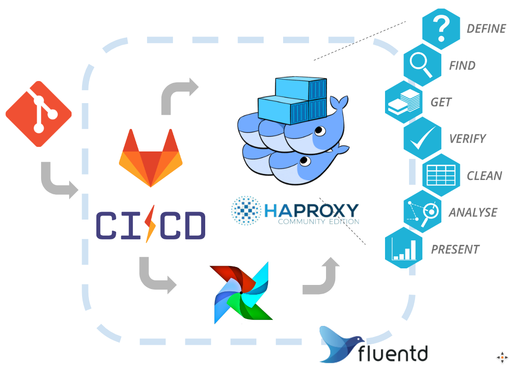

FridayMorning
=============
A learning (An exploratory) DevOps project for performing test in production on Friday Morning

# Table of Contents

1.  [Problem Statement](#org078dc04)
2.  [Proposed Solution](#orga957c65)
    1.  [Canary Testing](#orga673fba)
    2.  [The Demo](#orga44ba7d)
3.  [Tech Stack Overview](#orgcfaa68e)
    1.  [Overview](#org9d6e2e9)
    2.  [Gitlab CI/CD:](#orgb65640d)
    3.  [Docker Swarm + HAProxy](#org4cfb5e4)
    4.  [Fluentd](#orgf1835b6)
    5.  [InfluxDB + Grafana + Prometheus](#orga4c9f76)
4.  [Configuration Notes](#org54e7ebb)
    1.  [Gitlab CI](#orgd18f769)
        1.  [Gitlab CI Server](#org5db5a5c)
        2.  [Gitlab CI Runner](#org5640968)
        3.  [Fluentd](#orgd00a037)
5.  [For More Information](#orge5fd999)

# Problem Statement

Testing is a fundamental but potentially speed-limiting part in software development process.
Conducting tests that reflect the real world can be expensive.
The cost of infrastructure and engineer efforts to maintain an environment for testing may be significant.
Also, users can behave unexpectedly. 
Test in production can mitigate part of these problems.

# Proposed Solution

Streamlined test in production may ease the pain of setting up an ideal test environment.
By directing a proportion of workload to containers or virtual machine with new feature/commit,
this test-in-production setup will enable the collection of direct feedback from real user.
Also, with additional configuration, this setup will support tasks that require live migration.
The deliverable will be a system build on:

-   CI/CD enabled version control system (GitLab CI)
-   Container/virtual machine orchestration software (Docker Swarm)
-   Health/performance check and feedback mechanism to rollout/rollback (InfluxDB)
-   Monitoring tools (Grafana)

## Canary Testing

Canary testing is one of the methodologies of test in production.
The basic idea is that the newly released codes will serve only a small proportion of services.
Defects that is not caught during the prerelease testing may be detected in this canarying stage, 
which allows timely rollback to prevent further damage even system outage.

## The Demo

This project aims to demonstrate a canary testing use case for a web service.
This is done by setting up a pipeline for continuous deployment and a dashboard for web serivices performance monitoring.

The basic workflow can be described as:

1.  CI tool deploy new codes to containers that serve a load-balancer.
2.  Load-balancer collects and logs various measurements from the services.
3.  A log collection system aggregates and parses all log data.
4.  Metrics from the data is then aggregated into databases and populated on the dashboards.
5.  Monitoring/alerting tools will provide feedback to users and trigger rollout/rollback to settings.

# Tech Stack Overview

## Overview

## Gitlab CI/CD:

-   Consolidated VCS and CI/CD service
-   Great flexibility with Shell Runner (and etc.)
-   CI features are freely available. ([CE vs EE](https://about.gitlab.com/images/feature_page/gitlab-features.pdf))
-   Can setup ["manual" process](https://about.gitlab.com/2016/08/26/ci-deployment-and-environments/) (when sign-off, QA, etc. required)

## Docker Swarm + HAProxy

-   Docker Swarm is simple and straightforward (short lead time)
-   HAProxy has out-of-box weighted load balancing support
-   HAProxy can be integrated into Docker networks
-   Kubernetes, "the" contender, has all the features, but containering everything could be expensive

## Fluentd

-   Small, simple, straightforward, yet battle-tested
-   Natively supports log delivery for multiple programming languages, ideal for non-web applications

## InfluxDB + Grafana + Prometheus

-   SQL-like query supports, large user base, easy-to-use interfaces
-   Efficient persistent timeseries storage
-   Chronograf has more friendly query builder, but percentile is not yet available

# Configuration Notes

## Gitlab CI

### Gitlab CI Server

-   Gitlab Server is based on official AMI.
-   Baremetal, GCP, etc. installation instructions/scripts are available [here](https://about.gitlab.com/installation/).
-   A c4.large (or larger) is recommended in the instruction, but not required in this light-load demonstrative system.

### Gitlab CI Runner

-   Gitlab Runner handles the building/testing/deployment tasks.
-   Have Shell Runners installed on the system where applications are deployed can be the most straightforward way for setting up the pipelines.
-   Runner installation instructions [here](https://docs.gitlab.com/runner/install/). In short, install the package, get token from repo's [Settings > CI/CD > Runners], `gitlab-runner register` in service-providing servers.

### Fluentd

-   Fluentd is configured with multi-workers.
-   Fluentd is setup to listen to HAProxy through UDP. Capturing from log file (tail) is doable, and was easier to debug at the getting-hands-dirty stage, but disk usage and rsyslog setup are both unnecessary.
-   To have Fluentd works with other components, the plugins have to be installed first.

# For More Information

-   Check ".gitlab-ci.yml" for configuring CI pipeline in this [repository of the web service](https://gitlab.frimorn.net/FridayMorning/).

-   [Here](https://goo.gl/4P3o8M) for presentation slides.

