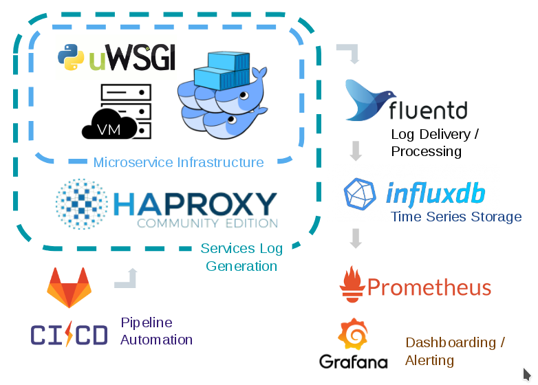

# fridaymorning
A learning (An exploratory) DevOps project for doing new release on Friday Morning (!?)

#### Problem Statement

Testing can be expensive and high maintenance to work, to be informative, and reflect the reality. It is fundamental but potentially slow-moving part to any software engineering project. Services that relies on real user feedback or real performance in production will benefit the most from this project. Additional benefit may include cost contamination and time for disaster recovery.

#### Proposed Solution

Streamlined test-in-production may ease the pain of setting up an ideal test environment. By directing a proportion of workload to containers or virtual machine with new feature/commit, this test-in-production setup can have the most direct feedback from real user. Also, with additional configuration, this setup will support tasks that require live migration. The deliverable will be a system build on: 

- CI/CD enabled version control system 
- Container/virtual machine orchestration software 
- Health/performance check and feedback mechanism for rollout/failure-recovery/rollback 
- Monitoring tools

 

#### Tech Stack

###### Gitlab CI/CD:	

- Consolidate vcs and CI/CD service	
- Great flexibility with Shell Runner (and etc.)

###### Docker Swarm / Terraform + HAProxy

- Simple and straightforward (as long as microservices)
- Weighted load balancing included

###### Airflow

- Dynamic workflow definition
- Python😀

